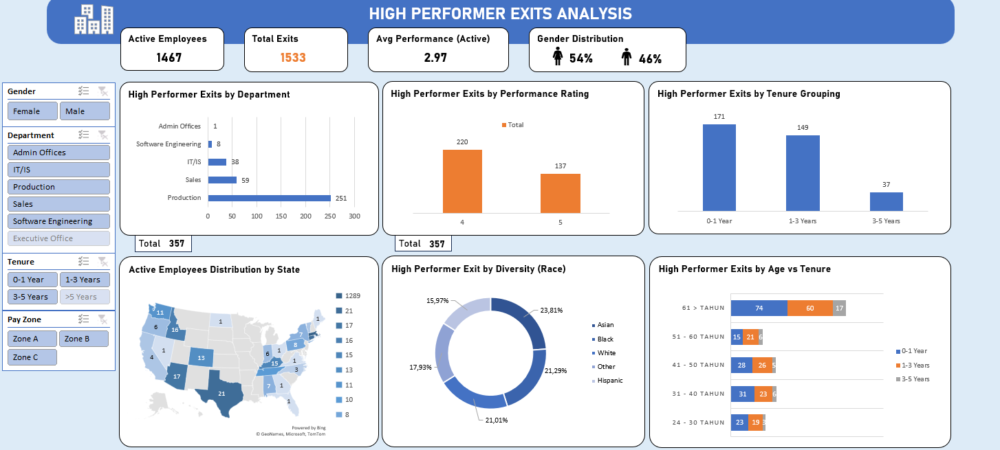

# High Performer Exits Analysis: People Analytics & Retention Optimization 📊


## 📌 Business Overview & Problem Statement

Mempertahankan talenta terbaik (*high performers*) merupakan salah satu pilar utama dalam manajemen sumber daya manusia (HR) untuk menjaga stabilitas operasional dan daya saing perusahaan. Biaya yang timbul akibat pergantian karyawan (*turnover cost*) — mulai dari rekrutmen hingga pelatihan — jauh lebih tinggi dibandingkan biaya retensi.

Melalui analisis terhadap dataset HR internal dengan **3.000 baris data dan 26 kolom**, ditemukan bahwa perusahaan menghadapi tantangan besar:

- **1.533 total karyawan** telah meninggalkan perusahaan
- **357 di antaranya** adalah karyawan dengan performa tinggi (rating performa **4 dan 5**)

Eksodus talenta ini berpotensi menurunkan standar kualitas output kerja secara keseluruhan. Proyek ini bertujuan menjawab beberapa pertanyaan bisnis krusial:

> - Departemen manakah yang memberikan kontribusi terbesar terhadap kehilangan *high performers*?
> - Apakah faktor usia memengaruhi pola keputusan karyawan berkinerja tinggi untuk keluar?
> - Bagaimana pola masa kerja (*tenure*) pada *high performers* yang keluar dari perusahaan?

---

## 🗂️ Repository Structure

```
hr-high-performer-exits-analysis
│
├── README.md                              # Dokumentasi utama proyek
├── data/
│   └── hr_dataset_raw.csv                 # Dataset HR internal mentah
├── excel/
│   └── hr_dataset_cleaned.xlsx            # File kerja Excel (Data Processing, Pivot, & Dashboard)
├── output/
│   ├── dashboard.png                      # Screenshot visualisasi dashboard Excel
└── report/
    └── hr_analysis_report.pdf             # Laporan formal analisis berkas PDF
```

---

## 💻 Tech Stack & Data Pipeline

Seluruh tahapan *data preparation*, *cleaning*, kalkulasi, hingga visualisasi dilakukan sepenuhnya menggunakan **Microsoft Excel** dengan pendekatan *end-to-end*.

### 1. Data Cleaning & Standardisation

| Tahap | Keterangan |
|-------|-----------|
| **Missing Value Management** | Mengidentifikasi nilai kosong pada kolom `Exit Date`. Setelah divalidasi, nilai kosong tersebut merupakan indikator organik yang menandakan karyawan masih aktif bekerja — bukan galat data. |
| **Concatenation & Deduplication** | Menggabungkan kolom `FirstName` dan `LastName` menggunakan `CONCAT` untuk validasi duplikasi. Ditemukan 2 nama identik, namun dikonfirmasi sebagai dua individu berbeda setelah divalidasi silang menggunakan `Born Date` dan `Race`. |
| **Data Inconsistency Fix** | Menangani ketidaksesuaian pelabelan silang antara variabel `Employee Type` dan `Employee Classification Type` (kontradiksi status *Full-time* vs *Part-time*). |

### 2. Feature Engineering & Formula Manipulation

| Fitur | Formula | Keterangan |
|-------|---------|-----------|
| **Calculated Tenure** | `=YEARFRAC()` | Mengonversi selisih tanggal menjadi angka tahun, lalu dikelompokkan ke dalam *Tenure Grouping* |
| **Calculated Age** | `=DATEDIF()` | Mengonversi tanggal lahir menjadi usia riil karyawan |
| **Outlier Detection** | Z-Score & IQR | Mendeteksi anomali pada kolom usia |

Formula Z-Score yang diterapkan:
```excel
=IF(([@AgeBenar]-AVERAGE([AgeBenar]))/STDEV([AgeBenar]))>3,"Outlier","Tidak")
```

> **Anomaly Detected:** Beberapa karyawan berusia produktif (24–30 tahun) salah dilabeli dengan alasan keluar *Retirement* oleh sistem — menunjukkan adanya kesalahan logika pelabelan otomatis.

---

## 🔍 Key Insights & Findings

### 1. 🏭 Dominasi Eksodus di Departemen Produksi

Mayoritas *high performers* yang keluar berasal dari departemen **Production** sebanyak **251 orang** — jauh melampaui departemen lain:

| Departemen | Jumlah Keluar |
|------------|--------------|
| Production | 251 |
| Sales | 59 |
| IT/IS | 38 |

Ini menjadi alarm bahwa lingkungan kerja, beban fisik, atau sistem insentif di area produksi kurang mendukung retensi jangka panjang.

### 2. ⚠️ Paradoks Kegagalan Onboarding Dini (< 1 Tahun)

Angka *exit* tertinggi terjadi pada **masa kerja di bawah 1 tahun** (171 karyawan) dan terjadi merata di seluruh kelompok usia. Yang paling mengkhawatirkan, **74 karyawan senior (usia 61+ tahun)** langsung keluar di tahun pertama — mencerminkan adanya masalah besar pada proses adaptasi budaya perusahaan dan penyelarasan ekspektasi kerja.

### 3. 🔬 Masalah Sistemik, Bukan Isu Diskriminasi

Sebaran *turnover* berdasarkan etnis terdistribusi secara proporsional di seluruh kelompok:

| Etnis | Proporsi |
|-------|---------|
| Asian | 23.81% |
| Black | 21.29% |
| White | 21.01% |
| Lainnya | ~33.89% |

Temuan ini membuktikan bahwa keluarnya *high performers* **bukan** dipicu isu diskriminasi, melainkan akibat **kelemahan sistemik operasional** yang dirasakan oleh seluruh kelompok.

### 4. 📉 Ancaman Degradasi Kualitas Perusahaan

Operasional organisasi terkonsentrasi di Massachusetts dengan **1.289 karyawan aktif**. Namun, rata-rata nilai performa karyawan yang bertahan hanya berada di level **2.97**. Jika kebocoran talenta *high performer* (rating 4 & 5) terus berlanjut, kapabilitas keseluruhan perusahaan dipastikan tertahan di level rata-rata.

---

## 💡 Strategic Recommendations

Berdasarkan temuan data di atas, berikut rekomendasi strategis berbasis data untuk manajemen HR:

**1. Tinjauan Beban & Kondisi Kerja Area Produksi**
Kepala Departemen Produksi bersama Tim HR & HSE (Health, Safety, and Environment) melakukan audit bersama terhadap distribusi jam lembur karyawan rating 4 & 5. Hasil audit digunakan untuk merestrukturisasi rotasi shift kerja secara lebih adil serta memperbaiki ergonomi fisik di lantai produksi untuk mengurangi kelelahan kerja (burnout).

**2. Program Revitalisasi Onboarding & "Senior Buddy System"**
HR bersama jajaran Manajer Departemen wajib menerapkan kerangka kerja Onboarding 30-60-90 Hari. Di minggu pertama, karyawan baru dipasangkan dengan karyawan senior (usia 61+ tahun) sebagai "Buddy/Mentor" formal untuk mendampingi proses adaptasi. HR kemudian melakukan check-in formal berkala pada bulan ke-1, ke-3, dan ke-6.

**3. Penerapan Berkala Stay Interviews**
HR memfasilitasi dan melatih para Line Managers (Supervisor ke atas) di seluruh departemen untuk melakukan Stay Interview dua kali dalam setahun khusus bagi karyawan aktif yang memiliki rating performa 4 dan 5. Wawancara ini berdurasi 30 menit untuk membahas motivasi kerja, hambatan, dan aspirasi karier mereka ke depan.

---

## 🖥️ Dashboard Preview

> Visualisasi interaktif dibangun menggunakan **Pivot Tables**, **Slicers**, dan **Dynamic Charts** di Excel untuk kebutuhan pelaporan eksekutif.



---

## 👤 Author

**Benedictus Irvanda Nugroho**
Data Analytics Portfolio Project · 2026

Focused on transforming raw business data into actionable insights through systematic data cleaning, rigorous exploratory analysis, and business intelligence reporting.

* **LinkedIn:** [irvandanugroho](https://linkedin.com/in/irvandanugroho/)
* **GitHub:** [Irvanda08](https://github.com/Irvanda08)
* **Email:** irvandanugroho08@gmail.com

---

*Proyek ini diselesaikan sebagai bagian dari portofolio profesional Data Analytics (2026).*
